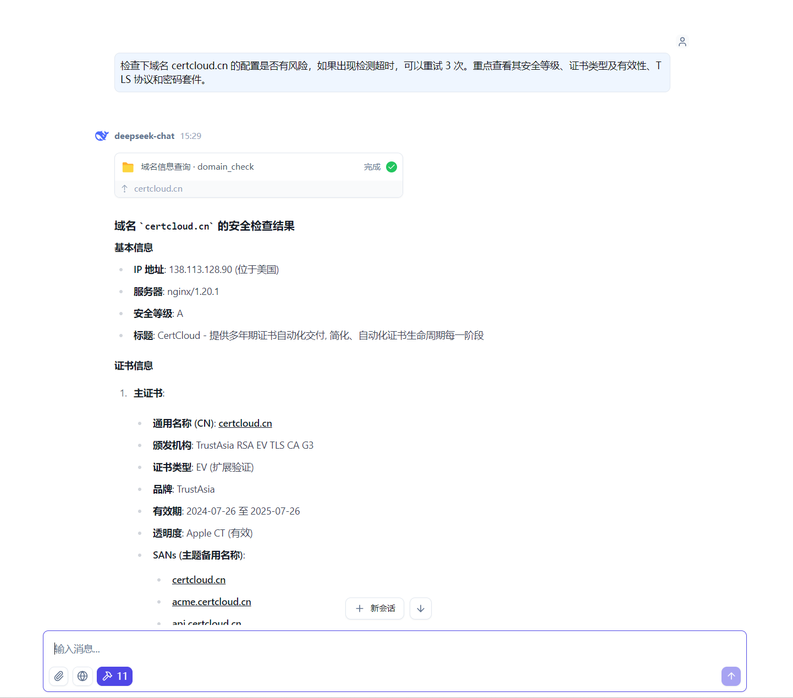
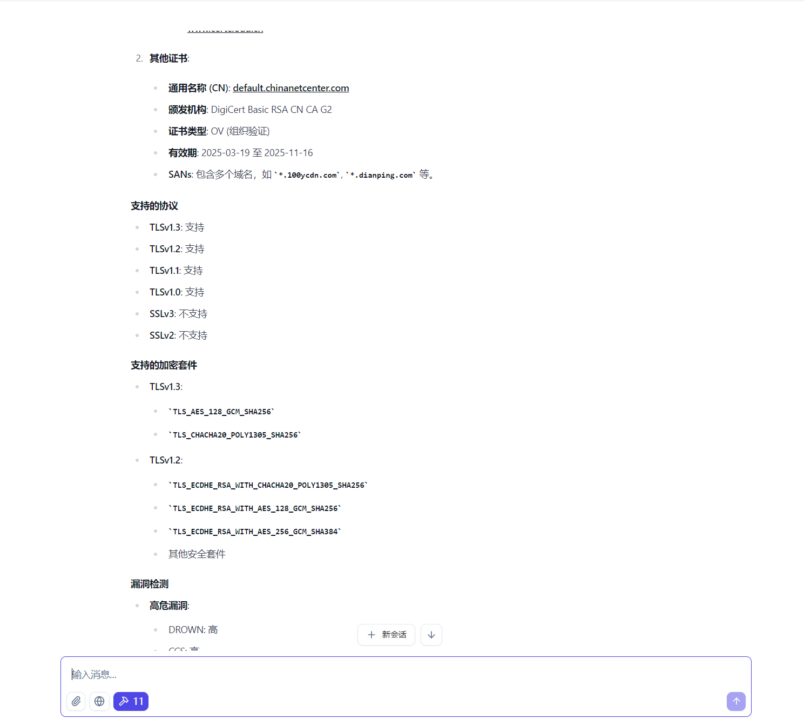
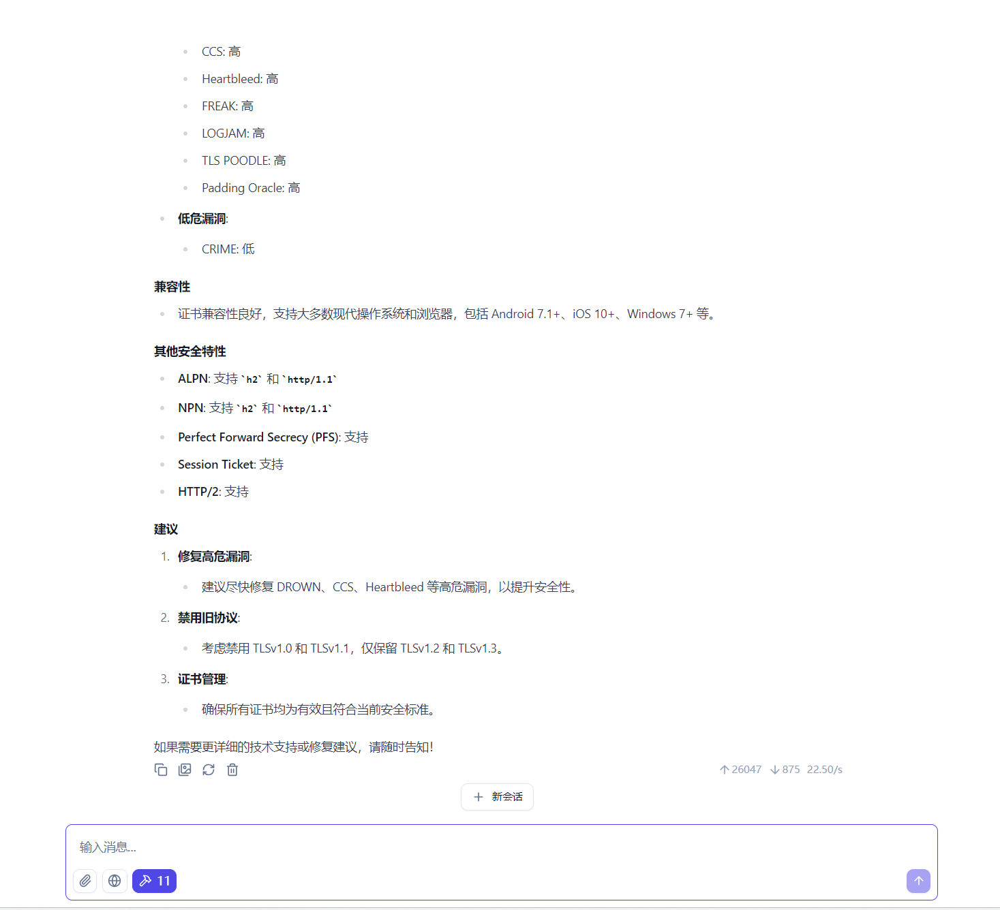

# MCP-Server-MySSL

An MCP server implementation that provides domain and IP security checking capabilities through the MySSL API.

## Features

- **Domain Check Tool**: Query information about domains to ensure secure HTTPS deployments
- **Health Check Tool**: Verify the MySSL service is operational
- **AI Client Integration**: Seamlessly integrates with compatible AI clients via the MCP protocol

## Requirements

- MySSL API credentials (AccessKey and SecretKey)
- Compatible AI client that supports MCP servers

## Installation

1. Download the appropriate release for your platform from the [Releases page](../../releases)
2. Extract the package
3. Set your MySSL API credentials as environment variables: 
```json
{
  "AccessKey": "ak_name",
  "SecretKey": "sk_value"
}
```
## Registering with AI Client

To use this MCP server, you need to register it with your AI client:

1. Open your AI client's plugin/extension management interface
2. Add a new MCP server with:
- Name: `mcp-server-myssl`
- Version: `1.0.0`
- Command: Path to the executable
- Working Directory: Where you extracted the files

## Usage

Once registered with your AI client, you can use the following tools:

### domain_check
Check information about a domain or IP.

Example prompt in your AI client: 
<p align='center'>
  
  
  
</p>

### health_check
Check if the MySSL service is operational.

Example prompt in your AI client:
> Check if the MySSL service is working

## Development

Building from source:  
`go build -o mcp-server-myssl .`
